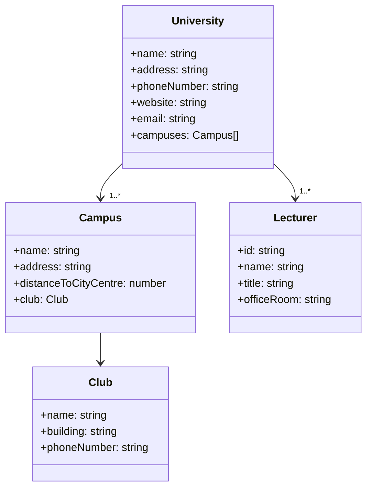

# Diagram

```mermaid
classDiagram

    class University {
        +name: string
        +address: string
        +phoneNumber: string
        +website: string
        +email: string
        +campuses: Campus[]
    }

    class Campus {
        +name: string
        +address: string
        +distanceToCityCentre: number
        +club: Club
    }

    class Club {
        +name: string
        +building: string
        +phoneNumber: string
    }

    class Lecturer {
        +id: string
        +name: string
        +title: string
        +officeRoom: string
    }

    University --> "1..*" Campus
    Campus --> Club
    University --> "1..*" Lecturer
    

```

