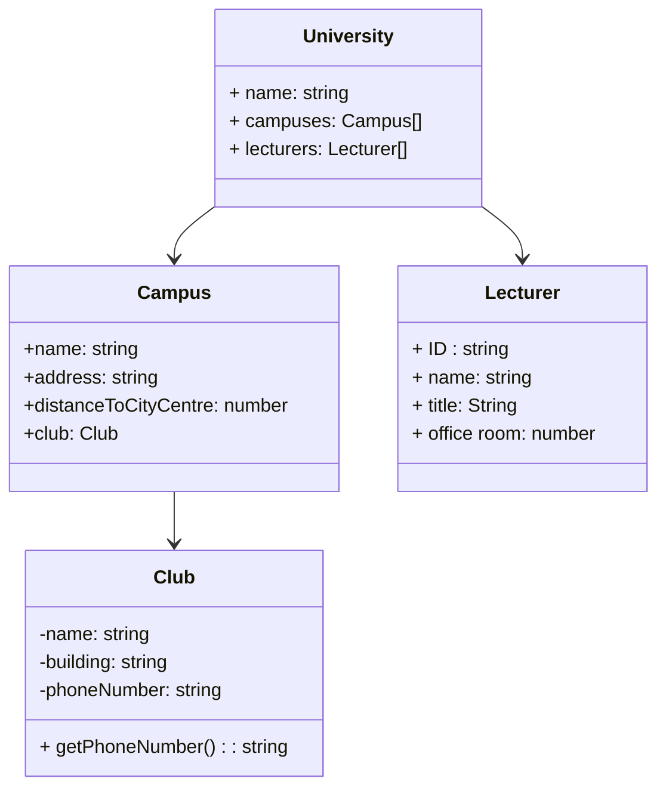

```mermaid
classDiagram
    class University{
        + name: string
        + campuses: Campus[]
        + lecturers: Lecturer[]
    }
    class Campus {
        +name: string
        +address: string
        +distanceToCityCentre: number
        +club: Club
    }

    class Club {
        -name: string
        -building: string
        -phoneNumber: string
        + getPhoneNumber(): string

    }

    class Lecturer{
        + ID : string
        + name: string
        + title: String
        + office room: number
    }
    

    University  -->  Lecturer
    University -->  Campus
    Campus --> Club
```